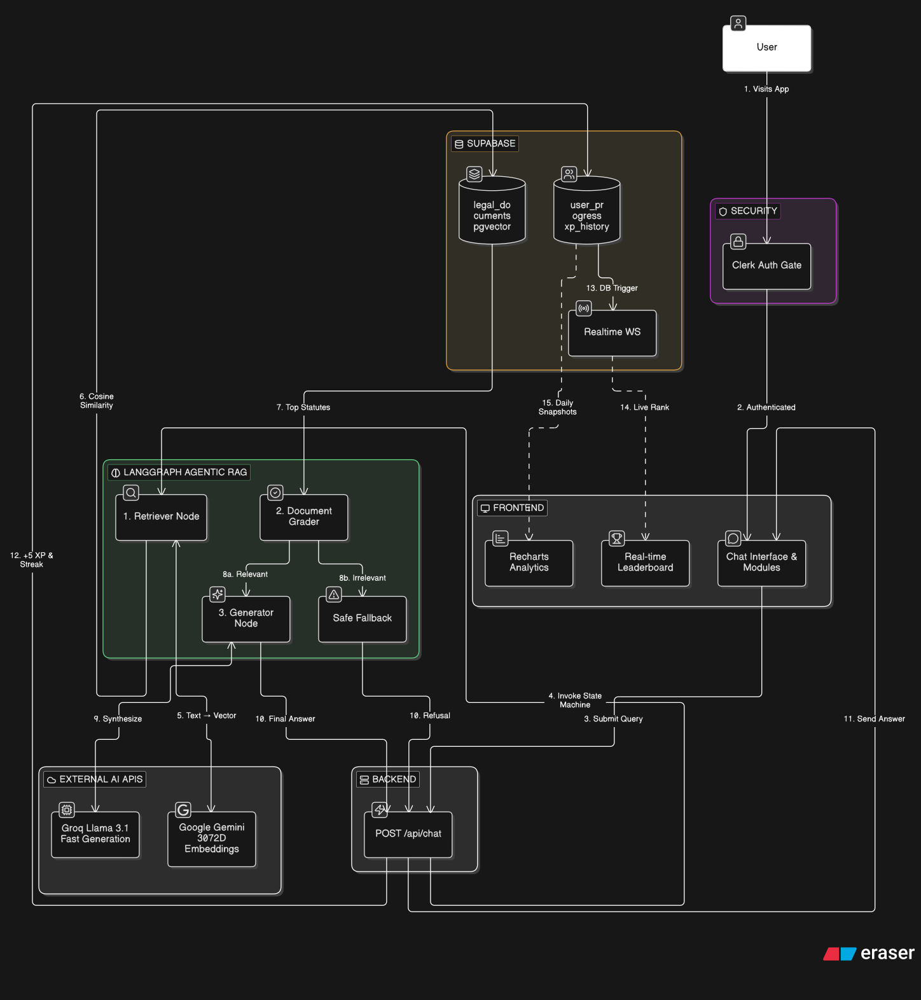

<div align="center">
  
  # ⚖️ NyayaSetu
  **Democratizing Indian Legal Knowledge through Agentic AI & Gamification**

  <a href="https://github.com/sponsors/prabhattopi">
    
  </a>
  <br /><br />

  [](https://nextjs.org/)
  [](https://supabase.com/)
  [](https://js.langchain.com/)
  [](https://clerk.com/)
  [](https://www.typescriptlang.org/)

  <br />

  <!-- 🎯 HERO ARCHITECTURE DIAGRAM -->
  
  
  <p><em>End-to-end Agentic RAG pipeline powering NyayaSetu</em></p>

</div>

<br/>

> **NyayaSetu** is an open-source, full-stack AI platform built to make the Indian legal system (including the new *Bharatiya Nyaya Sanhita - BNS*) accessible to everyone. By combining an **Agentic Retrieval-Augmented Generation (RAG)** architecture with modern EdTech gamification, NyayaSetu ensures zero-hallucination legal guidance while rewarding citizens for learning.

---

## ✨ Core Features

* 🧠 **Zero-Hallucination Legal AI:** Powered by a LangGraph Agentic RAG state machine that semantically searches verified Indian statutes. If a law isn't in the database, the AI safely refuses to answer.
* 🎮 **Gamified Learning Engine:** Earn Experience Points (XP) and maintain daily streaks by chatting with the AI and passing diagnostic legal quizzes.
* 📊 **Dynamic Analytics Dashboard:** Visualize your "Legal IQ" progression over time with beautiful, interactive Recharts.
* 🏆 **Real-Time Global Leaderboard:** Built with Supabase WebSockets—watch your rank climb live without refreshing the page!
* 📚 **Interactive Curriculum Modules:** Learn about constitutional and criminal law through structured, bite-sized lessons.

---

## 🛠️ Technology Stack

| Category | Technologies |
| :--- | :--- |
| **Frontend** | Next.js 16 (App Router), React 19, Tailwind CSS v4, Framer Motion, Recharts |
| **Backend & AI** | Node.js, LangGraph, LangChain, Groq (Llama 3.1), Google Generative AI (Embeddings) |
| **Database** | Supabase (PostgreSQL), `pgvector` extension, WebSockets (Realtime) |
| **Auth & Security** | Clerk v7, Next.js Middleware |

---

## 🏗️ Architecture: Agentic RAG Flow

<div align="center">
  
</div>

<br />

The diagram above shows the complete flow from user authentication to real-time leaderboard updates. Here's a breakdown of each stage:

<table>
  <tr>
    <td width="60"><h3>1️⃣</h3></td>
    <td>
      <strong>Query Submission</strong><br/>
      Authenticated users submit legal questions via the Next.js chat interface, which routes to <code>POST /api/chat</code>.
    </td>
  </tr>
  <tr>
    <td><h3>2️⃣</h3></td>
    <td>
      <strong>Vector Retrieval</strong><br/>
      The query is converted into a <strong>3072-dimensional embedding</strong> using <strong>Gemini</strong> and searched against <strong>pgvector</strong> via cosine similarity.
    </td>
  </tr>
  <tr>
    <td><h3>3️⃣</h3></td>
    <td>
      <strong>LangGraph Grading</strong><br/>
      The agentic state machine evaluates retrieved documents. Irrelevant results trigger a <strong>safe fallback</strong> to prevent hallucinations.
    </td>
  </tr>
  <tr>
    <td><h3>4️⃣</h3></td>
    <td>
      <strong>Answer Generation</strong><br/>
      <strong>Groq (Llama 3.1)</strong> synthesizes a clear response grounded strictly in retrieved statutes.
    </td>
  </tr>
  <tr>
    <td><h3>5️⃣</h3></td>
    <td>
      <strong>Reward & Realtime Sync</strong><br/>
      XP is upserted to Supabase, triggering WebSocket broadcasts that update the live leaderboard instantly.
    </td>
  </tr>
</table>

---

## 🚀 Project Setup & Local Development

Follow these steps to get your local development environment up and running.

### 1. Prerequisites
Ensure you have the following installed and set up:
* **Node.js** (v18 or higher)
* **npm**, **yarn**, or **pnpm**
* Accounts for the following services:
  * [Supabase](https://supabase.com/) (Database & Vector Store)
  * [Clerk](https://clerk.com/) (Authentication)
  * [Groq](https://groq.com/) (Fast LLM Inference)
  * [Google AI Studio](https://aistudio.google.com/) (Gemini Embeddings)

### 2. Clone the Repository
```bash
git clone [https://github.com/prabhattopi/nyayasetu.git](https://github.com/prabhattopi/nyayasetu.git)
cd nyayasetu
```
## 3. Install Dependencies

```
npm install
```
## 4. Environment Variables
Create a .env.local file in the root directory. Copy the following template and fill in your specific API keys:

```
# ==========================================
# 🔐 CLERK AUTHENTICATION
# ==========================================
NEXT_PUBLIC_CLERK_PUBLISHABLE_KEY=pk_test_your_clerk_publishable_key
CLERK_SECRET_KEY=sk_test_your_clerk_secret_key
NEXT_PUBLIC_CLERK_SIGN_IN_URL=/sign-in
NEXT_PUBLIC_CLERK_SIGN_UP_URL=/sign-up

# ==========================================
# 🗄️ SUPABASE (POSTGRESQL + PGVECTOR)
# ==========================================
NEXT_PUBLIC_SUPABASE_URL=[https://your-project-id.supabase.co](https://your-project-id.supabase.co)
NEXT_PUBLIC_SUPABASE_ANON_KEY=your_supabase_anon_key

# ==========================================
# 🧠 AI MODELS (GROQ & GEMINI)
# ==========================================
GROQ_API_KEY=gsk_your_groq_api_key
GEMINI_API_KEY=AIza_your_gemini_api_key
```
## 5. Supabase Database Setup
Head over to your Supabase Dashboard, open the SQL Editor, and run the following queries to set up your tables, vector extensions, and real-time triggers:

```
-- 1. Enable the pgvector extension for semantic search
CREATE EXTENSION IF NOT EXISTS vector;

-- 2. Create the Legal Documents Table
CREATE TABLE legal_documents (
  id BIGSERIAL PRIMARY KEY,
  content TEXT NOT NULL,
  metadata JSONB,
  embedding VECTOR(3072) 
);

-- 3. Create the Cosine Similarity Search Function
CREATE OR REPLACE FUNCTION match_legal_documents (
  query_embedding VECTOR(3072), match_threshold FLOAT, match_count INT
)
RETURNS TABLE (id BIGINT, content TEXT, metadata JSONB, similarity FLOAT)
LANGUAGE sql STABLE AS $$
  SELECT id, content, metadata, 1 - (embedding <=> query_embedding) AS similarity
  FROM legal_documents
  WHERE 1 - (embedding <=> query_embedding) > match_threshold
  ORDER BY embedding <=> query_embedding LIMIT match_count;
$$;

-- 4. Create User Progress Table (Gamification)
CREATE TABLE user_progress (
  id BIGSERIAL PRIMARY KEY,
  user_id TEXT NOT NULL UNIQUE,
  legal_iq INT DEFAULT 100,
  current_streak INT DEFAULT 0,
  last_active TIMESTAMP DEFAULT CURRENT_TIMESTAMP
);

-- 5. Create XP History Table (Analytics)
CREATE TABLE xp_history (
  id BIGSERIAL PRIMARY KEY,
  user_id TEXT NOT NULL,
  legal_iq INT NOT NULL,
  recorded_at DATE DEFAULT CURRENT_DATE,
  UNIQUE (user_id, recorded_at)
);
```
⚠️ Important: To make the Live Leaderboard work, go to Database → Replication in your Supabase dashboard and enable Insert/Update replication for the user_progress table.

## 6. Seed the Vector Database
Start the development server:

```
npm run dev
```
Open a new browser tab and navigate to:

http://localhost:3000/api/seed

Wait for the success message. This will vectorize the sample Indian Laws (Fundamental Rights, BNS Criminal Law) using Gemini and inject them into your Supabase database.

## 7. You're All Set! 🎉
Navigate to http://localhost:3000 to start exploring NyayaSetu.

## 🏗️ Architecture: Agentic RAG Flow

### 1. Query
User asks a legal question.

### 2. Retrieve
The query is converted into a **3072-dimensional vector embedding** using **Gemini Embeddings** and searched against **pgvector** using **Cosine Similarity** to retrieve the most relevant legal documents and statutes.

### 3. Grade (LangGraph)
Using **LangGraph**, the AI evaluates the retrieved context for relevance and completeness.  
If the retrieved documents do not contain a reliable answer, the workflow routes to a **safe fallback response** to prevent hallucinations.

### 4. Generate
**Groq (Llama 3.1)** generates a clear and easy-to-understand legal response based strictly on the retrieved statutes and legal references.

### 5. Reward
The system grants **XP points** and updates the **WebSocket-powered leaderboard** in real time.

---

## 💖 Support the Project

Building open-source LegalTech takes time, effort, and lots of coffee ☕.  
If you find this project useful or educational, consider supporting or sponsoring the project.

---

## 📝 License

This project is licensed under the **MIT License**.
